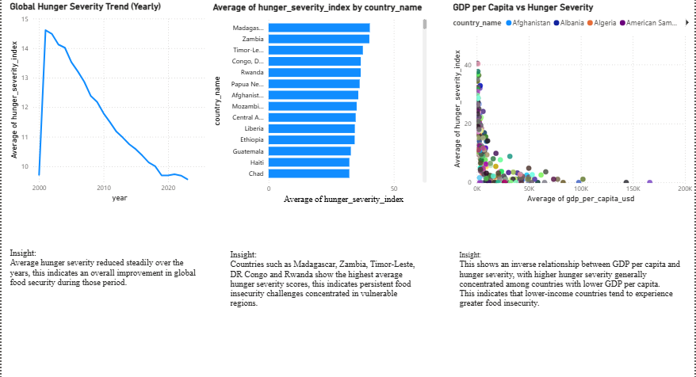

# Global Food Security Analysis

Analysis of global food security trends and hunger severity using SQL and Power BI.

## Project Overview

This project explores hunger severity across countries and over time. The analysis focuses on identifying countries with high hunger severity, examining the yearly trend in hunger severity, and exploring the relationship between GDP per capita and hunger severity.

## Tools Used

- MySQL
- Power BI
- Excel

## Analysis Questions

1. Which countries have the highest hunger severity?
2. How has global hunger severity changed over the years?
3. What is the relationship between GDP per capita and hunger severity?

## SQL Analysis

### 1. Top 10 Most Food-Insecure Countries

Identified the 10 countries with the highest hunger severity index.

### 2. Global Hunger Severity Trend by Year

Calculated the average hunger severity index for each year to examine the trend over time.

### 3. GDP vs Hunger Severity

Examined GDP per capita alongside hunger severity for different countries.

## Power BI Dashboard

The dashboard contains three visuals:

- Global Hunger Severity Trend (Yearly)
- Top 10 Most Food-Insecure Countries
- GDP per Capita vs Hunger Severity

### Key Insights

- Average hunger severity shows a general decline over the years in the dataset.
- Several countries show relatively high hunger severity, indicating persistent food-security challenges.
- Higher hunger severity is generally concentrated among countries with lower GDP per capita.

## Dashboard

## Project Files

- [SQL Analysis](global_food_security_analysis.sql)
- [Power BI Dashboard](global-food-security-dashboard.png)

